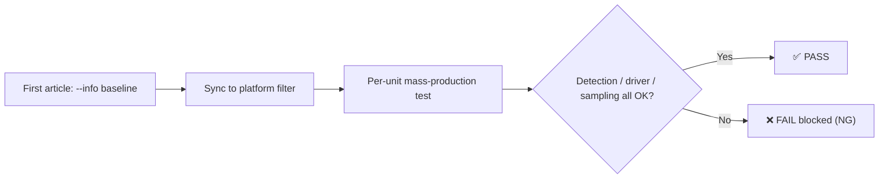

<p align="center">
  
</p>

<div align="center">
  <h1>gpu-test</h1>
  <p><strong>GPU Functional Test Plugin (Rust) · Works with all GPUs, NVIDIA first · One-click e-autotest integration</strong></p>
  <p>
    <a href="LICENSE">📄 MIT</a> |
    <a href="https://docs.rs/gpu-test">📚 Docs</a> |
    <a href="https://crates.io/crates/gpu-test">📦 crates.io v0.1.2</a> |
    <a href="https://gitee.com/eternalnight996/gpu-test">🌟 Gitee</a>
  </p>
  <p><a href="README.md">中文</a> | English</p>
</div>

---

> A production-line GPU check plugin: automatically verifies that the GPU is recognized by the OS, the driver is loaded,
> and `nvidia-smi` is stable. It blocks defective cards (not recognized / driver missing / intermittent loss) at the
> factory, and never false-positive machines without a discrete GPU.

## ✨ Features

- 🚫 **Automatic bad-card blocking**: enumerate → driver → functional self-check (utilization / power / temperature / clocks) → stability sampling; FAIL on any anomaly
- 🔁 **One-click first-article sync**: `--info` outputs model / driver / VRAM / VBIOS; mass production compares every unit, mismatch is blocked
- 🌐 **Cross-platform**: Windows 10/11 + Ubuntu 18.04+/Kylin V10/UOS V20 (x86_64)
- 🖥️ **Two run modes**: GUI with human confirmation + `--no-gui` CLI automation, both integrate with e-autotest
- 📊 **e-log standard logging**: file + stdout dual output, `R<{json}>R` platform contract, exit code 0/non-0 verdict
- 🛡️ **No false positives on iGPU machines**: no NVIDIA dGPU → PASS by default, logged only, never blocked

## 🔄 Workflow



> Model consistency (first article vs production) is validated by the platform against the `--info` identity; mismatch is blocked too.

## 🚀 Quick Start

### Install / Build

```bash
# Option 1: install directly (x86_64)
cargo install gpu-test

# Option 2: build from source (single justfile entry, no scripts)
just build-win     # Windows → target/release/gpu-test.exe
just build-linux   # Linux cross-compile (glibc 2.27 baseline)
just test          # unit tests (detection core, no real GPU needed)
```

### Example 1: One-click model sync (first article / production compare)

```bash
gpu-test --info
```

Real output (RTX 3060):

```
2026-08-12T04:46:42.594026Z  INFO gpu-test: 运行开始: sn= station= mode= samples=3
2026-08-12T04:46:42.944743Z  INFO gpu-test: 型号标识: GPU 0: NVIDIA GeForce RTX 3060 [10de:2487] 驱动:610.62 显存:12288 MiB VBIOS:94.04.71.00.c2 WMI驱动:32.0.16.1062
2026-08-12T04:46:42.944766Z  INFO gpu-test: 型号标识: GPU 1: OrayIddDriver Device 驱动:17.50.19.949
R<{"content":"GPU 0: NVIDIA GeForce RTX 3060 [10de:2487] 驱动:610.62 显存:12288 MiB VBIOS:94.04.71.00.c2 WMI驱动:32.0.16.1062\nGPU 1: OrayIddDriver Device 驱动:17.50.19.949","opts":{"api":"None","args":[],"command":[],"filter":[],"full":false,"init":false,"task":""},"status":true}>R
```

### Example 2: Automated functional test

```bash
gpu-test --no-gui --sn TEST001 --station FCT1 --mode AUTO --samples 3
```

Real output (logs are in Chinese):

```
2026-08-12T04:47:00.339075Z  INFO gpu-test: 运行开始: sn=TEST001 station=FCT1 mode=AUTO samples=3
2026-08-12T04:47:00.612700Z  INFO gpu-test: 硬件枚举:   NVIDIA GeForce RTX 3060 - 状态:OK 驱动:32.0.16.1062
2026-08-12T04:47:00.660348Z  INFO gpu-test: 显卡功能:   nvidia-smi: GPU 0: NVIDIA GeForce RTX 3060 (UUID: GPU-94c70323-272d-d7f7-902a-cbf18c996507)
2026-08-12T04:47:00.723550Z  INFO gpu-test: 功能自检: NVIDIA GeForce RTX 3060, 3 %, 47.57 W, 45, 1777 MHz, 7501 MHz
2026-08-12T04:47:00.770132Z  INFO gpu-test: 稳定性采样:   采样 1/3 正常
2026-08-12T04:47:01.328519Z  INFO gpu-test: 稳定性采样:   采样 2/3 正常
2026-08-12T04:47:01.887764Z  INFO gpu-test: 稳定性采样:   采样 3/3 正常
2026-08-12T04:47:01.887793Z  INFO gpu-test: status=PASS sn=TEST001 station=FCT1 mode=AUTO samples=3
R<{"content":"检测到显卡设备 2 个:\n  NVIDIA GeForce RTX 3060 - 状态:OK 驱动:32.0.16.1062\n  OrayIddDriver Device - 状态:OK 驱动:17.50.19.949\n检测到 NVIDIA 显卡 1 个，进入驱动与稳定性检查\n  nvidia-smi: GPU 0: NVIDIA GeForce RTX 3060 (UUID: GPU-94c70323-272d-d7f7-902a-cbf18c996507)\n  功能自检: NVIDIA GeForce RTX 3060, 3 %, 47.57 W, 45, 1777 MHz, 7501 MHz\n  采样 1/3 正常\n  采样 2/3 正常\n  采样 3/3 正常\nPASS: 显卡硬件识别正常，驱动已加载，nvidia-smi 采样 3 次全部正常","opts":{"api":"None","args":[],"command":[],"filter":[],"full":false,"init":false,"task":""},"status":true}>R
```

## 📷 UI Preview


GUI mode shows the detection steps live (hardware enumeration → driver check → functional self-check → stability
sampling). When done, click "确认" (Confirm) or use `--auto` to auto-close after a countdown; headless stations use `--no-gui`.

## 🗂️ Feature & Platform Support

| Module | Windows 10/11 | Ubuntu 18.04+ | Kylin V10 / UOS V20 | Status |
|---|---|---|---|---|
| Hardware enumeration (WMI / lspci) | ✅ | ✅ | ✅ | Verified |
| NVIDIA deep check (driver / smi / sampling) | ✅ | ✅ | ✅ | Verified on Windows + Ubuntu real machines |
| GUI human confirmation | ✅ | ✅ | ✅ | Verified |
| `--no-gui` automation | ✅ | ✅ | ✅ | Verified |
| iGPU-only machines (no dGPU) | ✅ no false positive | ✅ no false positive | ✅ no false positive | Verified |
| AMD / Intel dGPU deep check | 🚧 planned | 🚧 planned | 🚧 planned | Enumeration-compatible; deep check TODO |
| ARM64 | — | 🚧 planned | 🚧 planned | Build when customer machines are Phytium / Kunpeng |

## ⚙️ CLI Options

| Option | Description | Default |
|---|---|---|
| `--sn` | Serial number (passed in by the platform; optional manually; log only) | empty |
| `--station` | Station name (passed in by the platform; optional manually; log only) | empty |
| `--mode` | Mode (passed in by the platform; optional manually; log only) | empty |
| `--samples` | Number of nvidia-smi stability samples; more = stricter but slower | 3 |
| `--info` | Output only the one-click sync identity (model / driver / VRAM / VBIOS) for platform filter | off |
| `--no-gui` | No window; print directly to stdout (automation / debug) | off |
| `--auto` | Auto-close GUI after countdown when detection finishes | off |
| `--close SECS` | Auto-close countdown seconds | 5 |
| `--res PATH` | Additionally write the `R<json>R` result to a file (platform res_url) | empty |

## 🔌 e-autotest Integration

1. **Drop the plugin**: put `gpu-test` (Linux) / `gpu-test.exe` (Windows) into `plugins/gpu-test/`, `chmod +x` on Linux
2. **Register the APP** (extend_app config): two separate APPs are recommended, clear separation of duties

   | tag | args | Purpose |
   |---|---|---|
   | `GPU_TEST` | `--sn --station --mode --samples 3 --no-gui` | Functional test (automation) |
   | `GPU_TEST_INFO` | `--info` | Model identity (first article / production compare) |

   fileinfo essentials: `exe_type=WindowsExe/LinuxExe`, `architecture=X86_64`, `is_check=true` (parse `R<...>R`), `timeout=30s`
3. **Attach to the flow**: bind the APP to the GPU-check station, set `on_fail` to block (retest / report NG to MES)
4. **First-article sync**: run `gpu-test --info` on the first article, paste the identity into the platform "validation filter"
   (e.g. `*10de:2487*` or the model name); every production unit is compared automatically, mismatch → NG
5. **Verify**:

   ```bash
   gpu-test --no-gui --sn TEST001 --station FCT1 --mode AUTO
   echo $?    # 0 = PASS, non-zero = FAIL
   ```

### Output contract (e-autotest plugin standard)

- One line `R<{json}>R`; JSON is `{"content": "...", "status": true|false, "opts": {...}}`; `status` matches the exit code (0=PASS, non-0=FAIL)
- stdout also carries detailed e-log output (same format written to `logs/gpu-test.log`), ending with `R<...>R`; UTF-8 with forced flush; the platform parses the last `R<...>R`

## 💡 Why Choose

- **Pain**: 17 defective GPUs reported by one KA customer in a year (open-box + end-user), high DPPM; manual visual inspection misses too much → **automatic blocking**, every unit gets a functional test, anomaly = NG
- **Pain**: intermittent loss (flaky nvidia-smi) is hard to reproduce → **repeat sampling** (`--samples`, default 3), any failure is blocked
- **Pain**: first-article vs production compare relied on manual recording → **`--info` one-click sync**, the platform filter validates model / PCI ID per unit, mismatch is blocked
- **Pain**: legacy scripts blocked iGPU machines and false-positived healthy units → **no NVIDIA dGPU = PASS**, never blocks the line
- **Ecosystem fit**: logging uses e-log (same as e-autotest / etest), `R<{json}>R` + exit-code contract, zero platform changes needed

## 🛠 Development / Contributing

- Build via `justfile` (Windows needs VS/MSVC toolchain; Linux cross-compile needs cargo-zigbuild + zig, glibc 2.27 baseline)
- Architecture: `src/detect.rs` detection core (Windows WMI / Linux lspci enumeration + nvidia-smi functional checks), `src/gui.rs` egui UI, `src/logger.rs` e-log logging, `src/main.rs` CLI/GUI entry
- Before a PR: code follows conventions, core logic has unit tests, docs stay in sync
- Contributions welcome: fixes, new vendor support (AMD / Intel deep check), new check items

## 📄 License

[MIT](LICENSE)

<div align="center">
  <sub>If gpu-test helps you, give it a ⭐ Star or open a PR to make it better!</sub>
</div>

<div align="center"><sub>Built with ❤️ by HEG Technology</sub></div>
