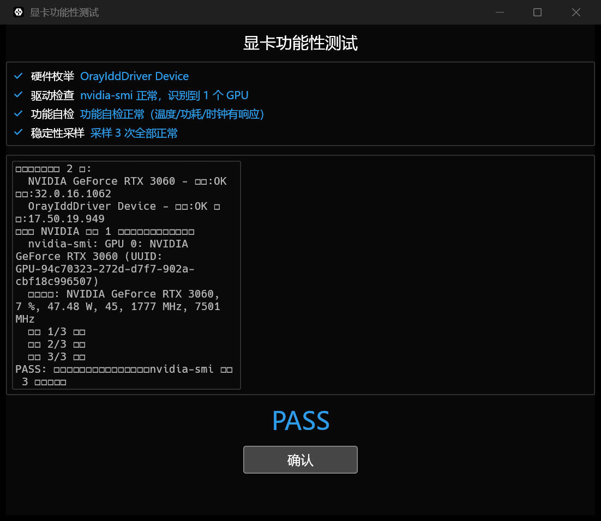

<div align="center">
  <h1>gpu-test</h1>
  <p><strong>GPU 功能性测试插件（Rust）· 兼容所有显卡，先完成 NVIDIA，一键接入 e-autotest 测试平台</strong></p>
</div>

<div align="center">
  [](LICENSE)
  [](https://docs.rs/gpu-test)
  [](https://crates.io/crates/gpu-test)
  简体中文
</div>

面向产线测试工位的显卡检测插件：自动识别显卡是否被系统识别、驱动是否正常加载、`nvidia-smi` 是否稳定，
对不良显卡（识别异常 / 驱动未装 / 概率性丢失）自动拦截；无独显机型不误杀。

## ✨ Features

- 🚫 **自动拦截不良显卡**：枚举 → 驱动 → 功能自检（利用率 / 功耗 / 温度 / 时钟）→ 稳定性采样，任一异常即 FAIL
- 🔁 **首件基准一键同步**：`--info` 输出型号 / 驱动 / 显存 / VBIOS，量产逐台比对，型号不一致即拦截
- 🌐 **全平台兼容**：Windows 10/11 + Ubuntu 18.04+/银河麒麟 V10/统信 UOS V20（x86_64）
- 🖥️ **双运行模式**：GUI 人工确认 + `--no-gui` 命令行自动化，均支持接入 e-autotest
- 📊 **e-log 标准日志**：文件 + stdout 双输出，结尾 `R<{json}>R` 平台契约，退出码 0/非 0 判定
- 🛡️ **不误杀核显机型**：无 NVIDIA 独显时默认 PASS，仅记录，不强制拦截

## 🚀 Quick Start

### 安装 / 构建

```bash
# 方式一：直接安装（x86_64）
cargo install gpu-test

# 方式二：从源码构建（统一入口 justfile，无独立脚本）
just build-win     # Windows → target/release/gpu-test.exe
just build-linux   # Linux 交叉编译（glibc 2.27 基线）
just test          # 单元测试（检测核心，无需真机）
```

### 示例 1：一键同步型号标识（首件基准 / 量产比对）

```bash
gpu-test --info
```

真实输出：

```
2026-08-12T04:46:42.594026Z  INFO gpu-test: 运行开始: sn= station= mode= samples=3
2026-08-12T04:46:42.944743Z  INFO gpu-test: 型号标识: GPU 0: NVIDIA GeForce RTX 3060 [10de:2487] 驱动:610.62 显存:12288 MiB VBIOS:94.04.71.00.c2 WMI驱动:32.0.16.1062
2026-08-12T04:46:42.944766Z  INFO gpu-test: 型号标识: GPU 1: OrayIddDriver Device 驱动:17.50.19.949
R<{"content":"GPU 0: NVIDIA GeForce RTX 3060 [10de:2487] 驱动:610.62 显存:12288 MiB VBIOS:94.04.71.00.c2 WMI驱动:32.0.16.1062\nGPU 1: OrayIddDriver Device 驱动:17.50.19.949","opts":{"api":"None","args":[],"command":[],"filter":[],"full":false,"init":false,"task":""},"status":true}>R
```

### 示例 2：自动化功能测试

```bash
gpu-test --no-gui --sn TEST001 --station FCT1 --mode AUTO --samples 3
```

真实输出：

```
2026-08-12T04:47:00.339075Z  INFO gpu-test: 运行开始: sn=TEST001 station=FCT1 mode=AUTO samples=3
2026-08-12T04:47:00.612700Z  INFO gpu-test: 硬件枚举:   NVIDIA GeForce RTX 3060 - 状态:OK 驱动:32.0.16.1062
2026-08-12T04:47:00.660348Z  INFO gpu-test: 显卡功能:   nvidia-smi: GPU 0: NVIDIA GeForce RTX 3060 (UUID: GPU-94c70323-272d-d7f7-902a-cbf18c996507)
2026-08-12T04:47:00.723550Z  INFO gpu-test: 功能自检: NVIDIA GeForce RTX 3060, 3 %, 47.57 W, 45, 1777 MHz, 7501 MHz
2026-08-12T04:47:00.770132Z  INFO gpu-test: 稳定性采样:   采样 1/3 正常
2026-08-12T04:47:01.328519Z  INFO gpu-test: 稳定性采样:   采样 2/3 正常
2026-08-12T04:47:01.887764Z  INFO gpu-test: 稳定性采样:   采样 3/3 正常
2026-08-12T04:47:01.887793Z  INFO gpu-test: status=PASS sn=TEST001 station=FCT1 mode=AUTO samples=3
R<{"content":"检测到显卡设备 2 个:\n  NVIDIA GeForce RTX 3060 - 状态:OK 驱动:32.0.16.1062\n  OrayIddDriver Device - 状态:OK 驱动:17.50.19.949\n检测到 NVIDIA 显卡 1 个，进入驱动与稳定性检查\n  nvidia-smi: GPU 0: NVIDIA GeForce RTX 3060 (UUID: GPU-94c70323-272d-d7f7-902a-cbf18c996507)\n  功能自检: NVIDIA GeForce RTX 3060, 3 %, 47.57 W, 45, 1777 MHz, 7501 MHz\n  采样 1/3 正常\n  采样 2/3 正常\n  采样 3/3 正常\nPASS: 显卡硬件识别正常，驱动已加载，nvidia-smi 采样 3 次全部正常","opts":{"api":"None","args":[],"command":[],"filter":[],"full":false,"init":false,"task":""},"status":true}>R
```

## 📷 界面预览



GUI 模式：检测过程实时展示（硬件枚举 → 驱动检查 → 功能自检 → 稳定性采样），完成后点「确认」或 `--auto` 倒计时自动关闭；无显示器工位用 `--no-gui`。

## 🗂️ 功能与平台支持

| 模块 | Windows 10/11 | Ubuntu 18.04+ | 麒麟 V10 / 统信 UOS V20 | 状态 |
|---|---|---|---|---|
| 硬件枚举（WMI / lspci） | ✅ | ✅ | ✅ | 已验证 |
| NVIDIA 深度检测（驱动 / smi / 采样） | ✅ | ✅ | ✅ | Windows + Ubuntu 真机已验证 |
| GUI 人工确认 | ✅ | ✅ | ✅ | 已验证 |
| `--no-gui` 自动化 | ✅ | ✅ | ✅ | 已验证 |
| 核显机型（无独显） | ✅ 不误杀 | ✅ 不误杀 | ✅ 不误杀 | 已验证 |
| AMD / Intel 独显深度检测 | 🚧 规划中 | 🚧 规划中 | 🚧 规划中 | 枚举兼容，深度检测待扩展 |
| ARM64 架构 | — | 🚧 规划中 | 🚧 规划中 | 客户机为飞腾 / 鲲鹏时构建 |

## 💡 Why Choose

- **痛点**：单客户一年反馈 17 块不良显卡（开箱 + 终端），不良 DPPM 高企，靠人工目检漏检严重 → **自动拦截**，每台量产机跑一遍功能测试，异常即 NG
- **痛点**：概率性丢失（nvidia-smi 偶发失败）难以复现 → **连续采样 N 次**（`--samples`，默认 3），任一次失败即拦截
- **痛点**：首件 / 量产信息比对靠人工抄录 → **`--info` 一键同步**，平台 filter 按型号 / PCI ID 逐台校验，不一致即拦截
- **痛点**：旧测试脚本只拦截核显，误杀正常机型 → **无 NVIDIA 独显默认 PASS**，不阻断产线
- **兼容现有生态**：日志框架统一 e-log（与 e-autotest / etest 一致），输出契约 `R<{json}>R` + 退出码，平台无需改造即可接入

## 🛠 Development / Contributing

- 构建统一走 `justfile`（Windows 需 VS/MSVC 工具链；Linux 交叉编译需 cargo-zigbuild + zig，glibc 2.27 基线）
- 架构：`src/detect.rs` 检测核心（Windows WMI / Linux lspci 枚举 + nvidia-smi 功能检测）、`src/gui.rs` egui 界面、`src/logger.rs` e-log 日志、`src/main.rs` CLI/GUI 入口
- 提交 PR 前：代码符合规范、核心逻辑有单元测试、文档与代码同步更新
- 欢迎贡献：修复、新增显卡厂商支持（AMD / Intel 深度检测）、新增检测项

## 📄 License

[MIT](LICENSE)

<div align="center"><sub>Built with ❤️ by HEG Technology</sub></div>
